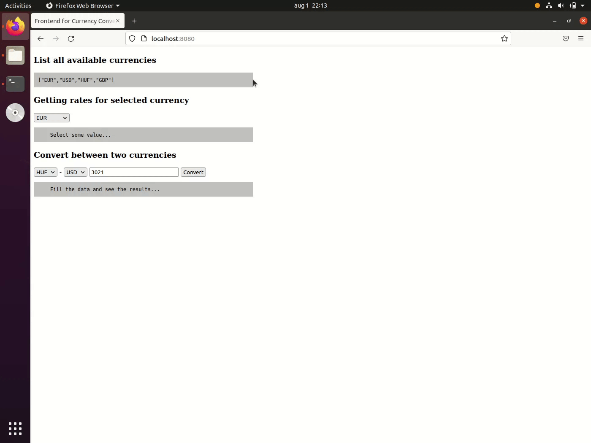
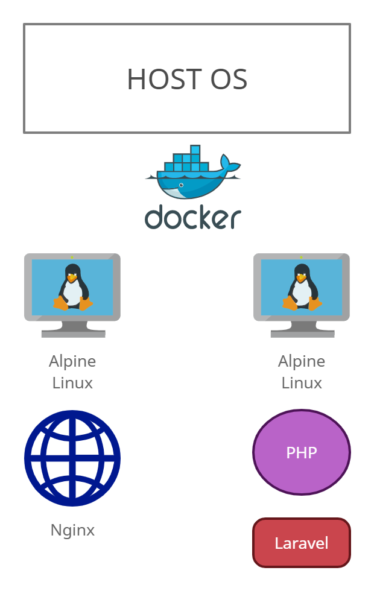

<div style="text-align:center">

<h1>Currency Converter Test</h1>


</div>

## Overview

The Currency Convert Test is a Laravel based application, which was created
as a probation work, to demonstrate my current knowledge about Laravel, PHP, Docker
system architecture planning based on business requirements.




## Requirements

### Tools and development environment
* Any type of linux distribution
* Composer (>= 2.x)
* Docker Engine (>= 2.0)
* Docker-Compose (>= 1.25 )

### Software
* Alpine Linux
* NGINX (>= 1.x)
* PHP (>= 8.0)
* Laravel (>= 8.0)

### Other
* Could be found in `composer.json`

## Running Tests


Run:
`php artisan test`

## Installation instructions

### 1. Download/clone the files from here
```shell
git clone https://github.com/sosmarton/currency-converter-test
```
### 2. Copy the `.env` file to the root of the project
(The file is sent via email)

### 3. Install composer dependencies and copy src files to src directory
```shell
make pre-install
```

### 4. Configure proper permissions for the `src` directory

It is a requirement for Alpine Linux to work properly.
The 82 UID/GUID is the Nginx users UID/GUID for Alpine linux.

(It was separated from the Makefile because it runs "sensitive" commands on the Host OS)

```shell
sudo chmod -R 755 ./src/*
sudo chown -R 82:82 ./src/* 
```

### 5. Enter `[project root]/docker` directory and setup the containers
```shell
cd docker
make install
```

### 6. Visit site
Visit and see frontend at `http://localhost:8080`.

## Specifications

### Infrastructure overview



## Useful Links

* [OpenAPI Speciifcation](./docs/specifications/api-specification.yml)
  * ```I fixed the OpenAPI specification, because there were some typos.```

